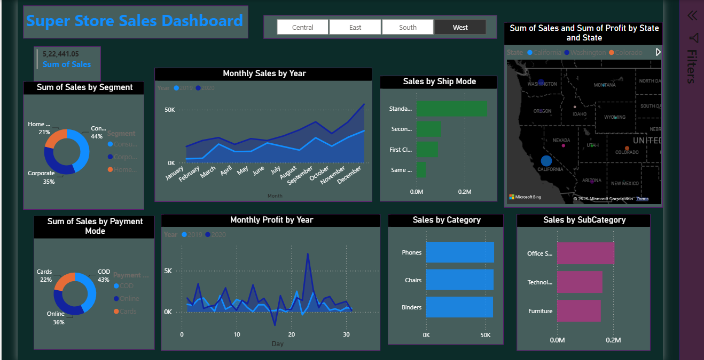
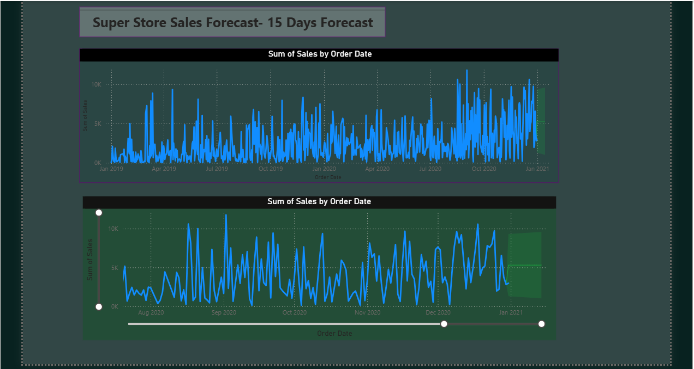

# Super Store Sales Dashboard (Power BI)

An interactive **Power BI dashboard** built on Superstore sales data, covering sales performance analysis, profit trends, and a 15-day sales forecast.

## 📊 Overview

This project analyzes retail sales data across regions, categories, and time periods, and includes a forecasting page to project short-term sales trends.

**File:** `sales.pbix`

## 🖥️ Dashboard Pages

### 1. Sales Overview
- **KPI Card:** Sum of Sales — 5,22,441.05 (shown here with the **West** region filter applied)
- **Sales by Segment** – donut chart (Consumer 44%, Corporate 35%, Home Office 21% for West)
- **Monthly Sales by Year** – area chart comparing 2019 vs 2020
- **Sales by Ship Mode** – bar chart (Standard, Second, First Class, Same Day)
- **Sum of Sales & Profit by State** – interactive US map
- **Sales by Payment Mode** – donut chart (Cards, COD, Online)
- **Monthly Profit by Year** – area chart
- **Sales by Category** – bar chart (Phones, Chairs, Binders)
- **Sales by Sub-Category** – bar chart (Office Supplies, Technology, Furniture)
- **Region Filter Slicer** – Central / East / South / West



### 2. Sales Forecast (15 Days)
- Time series of **Sum of Sales by Order Date** (Jan 2019 – Jan 2021)
- Zoomed-in view with a **15-day forecast band** and interactive date-range slider



## 🛠️ Tools Used
- **Power BI Desktop** – data modeling, DAX measures, visualization, and forecasting

## 📂 Dataset

The report is built on the **Superstore Sales dataset** (~5,897 records, 27 columns), exported directly from the Power BI data model.

**File:** `data/superstore_sales_data.csv`

Key fields: `Order ID`, `Order Date`, `Ship Date`, `Customer ID/Name`, `Segment`, `Category`, `Sub-Category`, `Product Name`, `Sales`, `Profit`, `Quantity`, `Region`, `State`, `City`, `Payment Mode`, `Ship Mode`, `Returns`.

> No SQL database or external data warehouse was used — the data was imported directly into Power BI's in-memory data model.

## 📁 Repository Structure
```
├── sales.pbix                         # Power BI report file
├── data/
│   └── superstore_sales_data.csv      # Underlying dataset
├── screenshots/
│   ├── dashboard-overview.png
│   └── sales-forecast.png
└── README.md
```

## 🚀 How to Use
1. Download `sales.pbix`
2. Open it in **Power BI Desktop** (free download from Microsoft)
3. Explore the interactive filters, slicers, and forecast panel

## 📌 Key Insights (from full dataset, 5,897 records)
- **Total Sales:** 15,65,804.32 | **Total Profit:** 1,75,262.11
- **Consumer segment** leads with 48.1% of total sales, followed by Corporate (32.6%) and Home Office (19.4%)
- **Office Supplies** is the top-selling category (6,43,707.69), followed by Technology and Furniture
- **West** is the highest-selling region (5,22,441.05), followed by East, Central, and South
- **California** is the top-performing state by sales (3,35,190.26), followed by New York and Texas
- **Standard Class** is the most-used shipping mode (58.5% of orders)
- **COD** is the leading payment mode by sales value (42.6%), followed by Online (35.4%) and Cards (22.0%)
- Only **4.9%** of orders were returned (287 out of 5,897)
